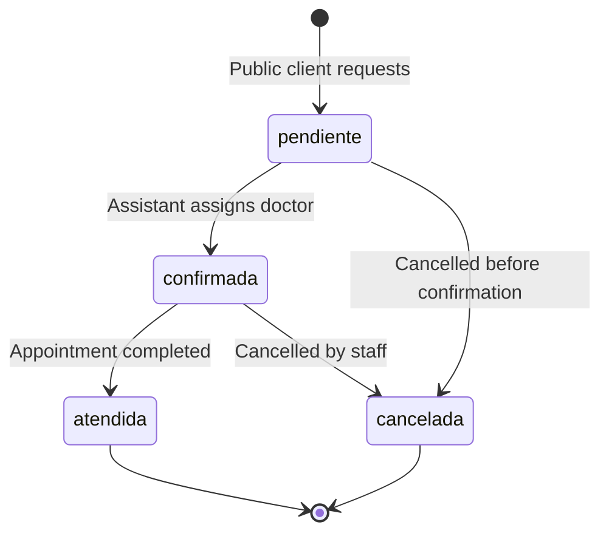

## Overview

The Medical Center API manages appointments through a **multi-stage workflow** that transitions from public requests to confirmed appointments with assigned doctors.

## Appointment Lifecycle



## Status States

### 1. Pendiente (Pending)

**Initial state** when a public client submits an appointment request.

```javascript
estado: "pendiente"
medico_id: null  // No doctor assigned yet
fecha_confirmada: null
hora_confirmada: null
```

<Info>
  Public clients can request appointments without authentication. The system creates both a `Clientes_publicos` record and a `Citas` record in a single transaction.
</Info>

### 2. Confirmada (Confirmed)

**Assigned state** after an admin or assistant assigns a doctor and confirms the date/time.

```javascript
estado: "confirmada"
medico_id: 5  // Doctor assigned
fecha_confirmada: "2024-03-15"  // May differ from fecha_solicitada
hora_confirmada: "14:30:00"
```

<Note>
  The confirmed date/time can differ from the requested date/time if the assistant needs to reschedule based on doctor availability.
</Note>

### 3. Atendida (Attended)

**Completed state** after the appointment has been attended.

```javascript
estado: "atendida"
```

<Warning>
  An appointment can **only** transition to `atendida` from `confirmada` state. The API validates this business rule.
</Warning>

### 4. Cancelada (Cancelled)

**Cancelled state** - can be set from either `pendiente` or `confirmada`.

```javascript
estado: "cancelada"
medico_id: null  // Doctor assignment removed
```

## Workflow Stages

### Stage 1: Public Appointment Request

**Endpoint**: `POST /api/citas` (No authentication required)

A public client submits basic information and desired date/time:

```javascript
POST /api/citas
Content-Type: application/json

{
  "nombres": "Juan Pérez",
  "apellidos": "García",
  "telefono": "555-1234",
  "email": "juan@example.com",
  "fecha_solicitada": "2024-03-15",
  "hora_solicitada": "14:00",
  "sintomas": "Dolor de cabeza persistente"
}
```

**What happens**:

1. System creates a `Clientes_publicos` record:
   ```javascript
   const cliente = await prisma.clientes_publicos.create({
     data: {
       nombres: nombres.trim(),
       apellidos: apellidos?.trim() || null,
       telefono,
       email: email?.trim() || null,
     },
   });
   ```

2. System creates a `Citas` record in `pendiente` state:
   ```javascript
   const cita = await prisma.citas.create({
     data: {
       cliente_id: cliente.id,
       fecha_solicitada: new Date(`${fecha_solicitada}T00:00:00`),
       hora_solicitada: new Date(`1970-01-01T${hora_solicitada}:00`),
       sintomas: sintomas?.trim() || null,
       estado: "pendiente",
     },
   });
   ```

<Accordion title="Why separate date and time fields?">
  The schema uses PostgreSQL's `@db.Date` and `@db.Time` types:
  - `fecha_solicitada` / `fecha_confirmada`: Date only (no time component)
  - `hora_solicitada` / `hora_confirmada`: Time only (stored as time-of-day)
  
  This allows precise control over scheduling without timezone confusion.
</Accordion>

**Response**:
```json
{
  "message": "Cita registrada",
  "cita": {
    "id": 42,
    "cliente_id": 15,
    "fecha_solicitada": "2024-03-15T00:00:00.000Z",
    "hora_solicitada": "1970-01-01T14:00:00.000Z",
    "fecha_confirmada": null,
    "hora_confirmada": null,
    "medico_id": null,
    "sintomas": "Dolor de cabeza persistente",
    "estado": "pendiente",
    "created_at": "2024-03-10T09:15:00.000Z"
  }
}
```

### Stage 2: Assistant Reviews Pending Appointments

**Endpoint**: `GET /api/citas` (Requires auth: admin or asistente)

Staff members view all appointments with full details:

```javascript
GET /api/citas
Authorization: Bearer <token>
```

**Response includes**:
- Client information (`cliente`)
- Assigned doctor details if confirmed (`medico.persona`, `medico.especialidad`)
- All date/time fields
- Current status

**Searching appointments**:
```javascript
GET /api/citas/buscar?q=Juan
Authorization: Bearer <token>
```

Searches by patient name (nombres or apellidos), returning up to 10 recent matches.

### Stage 3: Confirming and Assigning

**Endpoint**: `PUT /api/citas/:id/confirmar` (Requires auth: admin or asistente)

Assistant assigns a doctor and confirms the appointment:

```javascript
PUT /api/citas/42/confirmar
Authorization: Bearer <token>
Content-Type: application/json

{
  "medico_id": 5
}
```

**Implementation**:
```javascript
const cita = await prisma.citas.update({
  where: { id },
  data: {
    medico_id: Number(medico_id),
    estado: "confirmada",
    fecha_confirmada: new Date(), // Current date
    hora_confirmada: new Date(),  // Current time
  },
});
```

<Info>
  The `fecha_confirmada` and `hora_confirmada` are set to the current date/time when confirming. In practice, these should be set to the actual scheduled date/time (which may match `fecha_solicitada` or be different).
</Info>

**Response**:
```json
{
  "message": "Cita confirmada correctamente",
  "cita": {
    "id": 42,
    "estado": "confirmada",
    "medico_id": 5,
    "fecha_confirmada": "2024-03-15T00:00:00.000Z",
    "hora_confirmada": "1970-01-01T14:30:00.000Z"
  }
}
```

### Stage 4: Marking as Attended

**Endpoint**: `PUT /api/citas/:id/atender` (Requires auth: admin or asistente)

After the appointment is completed:

```javascript
PUT /api/citas/42/atender
Authorization: Bearer <token>
```

**Validation**:
```javascript
if (cita.estado !== "confirmada") {
  return res.status(400).json({
    message: "Solo se pueden atender citas confirmadas",
  });
}
```

**Update**:
```javascript
const actualizada = await prisma.citas.update({
  where: { id },
  data: {
    estado: "atendida",
  },
});
```

<Warning>
  **Business Rule**: Only appointments in `confirmada` state can transition to `atendida`. The API enforces this validation.
</Warning>

### Stage 5: Cancellation

**Endpoint**: `PUT /api/citas/:id/cancelar` (Requires auth: admin or asistente)

Cancelling an appointment (from any state):

```javascript
PUT /api/citas/42/cancelar
Authorization: Bearer <token>
```

**Implementation**:
```javascript
const cita = await prisma.citas.update({
  where: { id },
  data: {
    estado: "cancelada",
    medico_id: null,  // Remove doctor assignment
  },
});
```

<Note>
  Cancelling an appointment **removes the doctor assignment** (`medico_id` set to `null`), freeing up the doctor's schedule.
</Note>

## Date/Time Field Comparison

| Field | Set By | When | Purpose |
|-------|--------|------|----------|
| `fecha_solicitada` | Public client | Appointment request | Patient's preferred date |
| `hora_solicitada` | Public client | Appointment request | Patient's preferred time |
| `fecha_confirmada` | Assistant | Confirmation | Actual scheduled date |
| `hora_confirmada` | Assistant | Confirmation | Actual scheduled time |

<Accordion title="Why have both requested and confirmed dates?">
  **Flexibility in scheduling**:
  - Patient requests a date/time that may not be available
  - Assistant can reschedule to an available slot
  - System maintains both for record-keeping and transparency
  - Patient can be notified of the actual confirmed date/time
</Accordion>

## Complete Workflow Example

### Day 1: Patient Requests Appointment

```json
// POST /api/citas
{
  "nombres": "María González",
  "telefono": "555-9876",
  "fecha_solicitada": "2024-03-20",
  "hora_solicitada": "10:00",
  "sintomas": "Control de presión arterial"
}

// State: pendiente
// medico_id: null
```

### Day 2: Assistant Reviews and Confirms

```json
// PUT /api/citas/42/confirmar
{
  "medico_id": 7  // Dr. López, Cardiology
}

// State: confirmada
// medico_id: 7
// fecha_confirmada: "2024-03-20" (matches request)
// hora_confirmada: "10:00:00" (matches request)
```

### Day 15: Patient Attends Appointment

```json
// PUT /api/citas/42/atender

// State: atendida
// Final state - workflow complete
```

### Alternative: Cancellation

```json
// PUT /api/citas/42/cancelar

// State: cancelada
// medico_id: null (doctor freed up)
```

## Admin-Only Operations

### Deleting Appointments

**Endpoint**: `DELETE /api/citas/:id` (Requires auth: admin only)

```javascript
DELETE /api/citas/42
Authorization: Bearer <token>
```

<Warning>
  Only **admins** can permanently delete appointments. This is a destructive operation that also triggers cascade deletion of related `Historial` records.
</Warning>

## Medical History Notes

After an appointment is attended, staff can add notes to the `Historial` table:

```javascript
// Related model (from schema)
model Historial {
  id         Int      @id @default(autoincrement())
  cita_id    Int
  notas      String?
  created_at DateTime @default(now())

  cita Citas @relation(fields: [cita_id], references: [id], onDelete: Cascade)
}
```

<Info>
  Multiple history records can be associated with a single appointment, allowing for follow-up notes or amendments.
</Info>

## Best Practices

<Accordion title="Workflow Guidelines">
  **For Assistants**:
  - Review pending appointments daily
  - Confirm appointments only when doctor availability is verified
  - Update `fecha_confirmada` to the actual scheduled date if different from request
  - Mark appointments as attended promptly after completion
  - Cancel with appropriate notice if rescheduling is needed

  **For Admins**:
  - Use deletion sparingly - prefer cancellation for tracking
  - Monitor appointment metrics via dashboard
  - Ensure doctors have appropriate schedules

  **For Developers**:
  - Always validate status transitions
  - Include full relations when fetching appointments for display
  - Handle date/time formatting carefully (PostgreSQL Date/Time types)
  - Implement notifications for status changes (future enhancement)
</Accordion>

## Common Edge Cases

<Warning>
  **Prevented Operations**:
  - ❌ Cannot mark `pendiente` appointment as `atendida` (must confirm first)
  - ❌ Cannot confirm without assigning a doctor
  - ✅ Can cancel from any state
  - ✅ Can assign different doctors by updating `medico_id` while `confirmada`
</Warning>